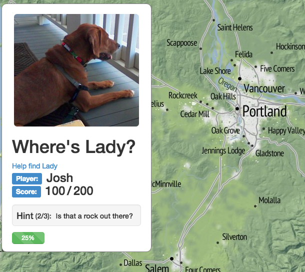

# Where's Lady?

Where's Lady is a mapping game to help locate famous landmarks in Oregon.  It was built using Leaflet and designed with Bootstrap.

Play it here on github pages: [whereslady](http://tannerjt.github.io/whereslady)

